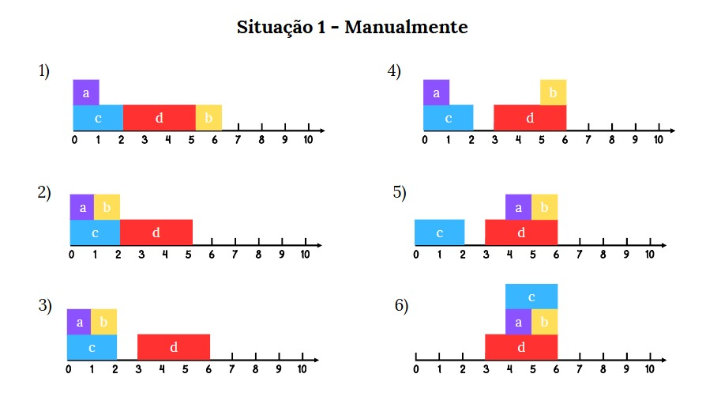
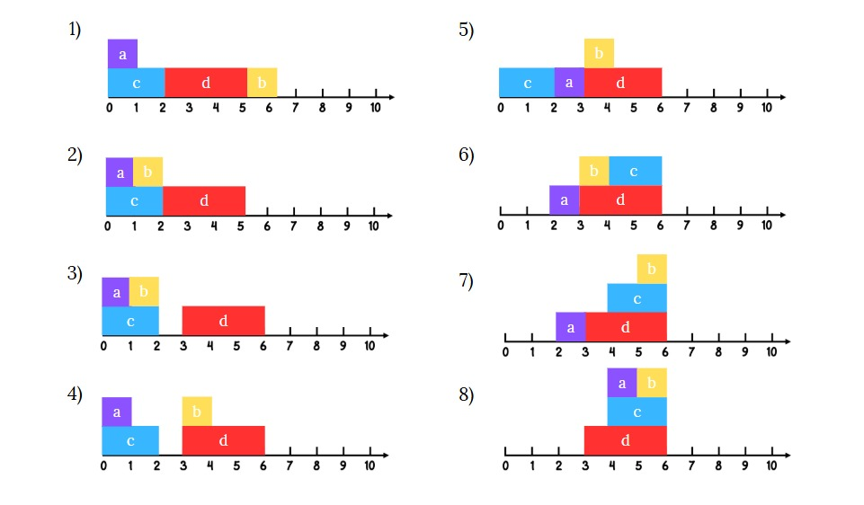
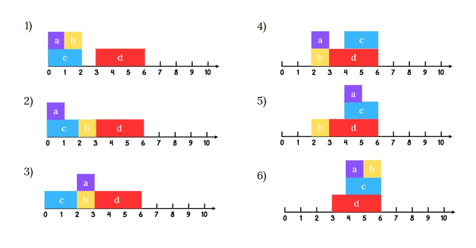
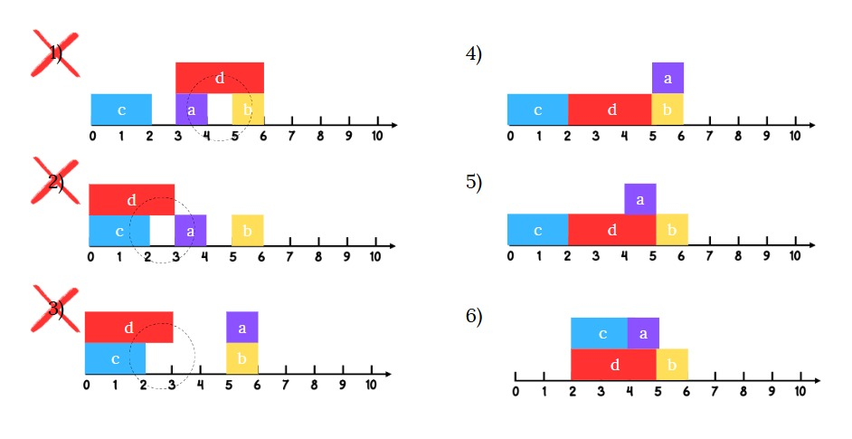

**Universidade Federal do Amazonas**

**Aline da Conceição Ferreira Lima - 22250366**

**João Victor Félix Guedes - 22050227**

**Karen Letícia Santana da Silva-22051416**

**Inteligência Artificial**

**Planejador para Empilhar**

**Manaus-AM**

**2024**

# **Resposta explicativa para cada item do PDF**

## **1.1. Situação 1**

## **1.1.1. s_inicial=i2 até o estado s_final=i2 (a).**

Após a análise da Situação 1, do estado inicial (i2) até o estado (i2a),
é possível observar que, com base nas restrições definidas e
implementadas pelo grupo, existe uma sequência viável de ações que
conduz ao objetivo final (goal). Dessa forma, considerando o estado
inicial (1) e o estado final (6), ambos representados na figura acima,
podemos estabelecer o seguinte plano de ações, ilustrado na Figura 1:

**Manualmente (linguagem natural)**

1.  posição inicial

2.  b é movido da posição 5 (na mesa) p/ a posição 1 (em cima de c);

3.  d é movido da posição 2, 3 e 4 (na mesa) p/ a posição 3, 4 e 5 (na
     mesa);

4.  b é movido da posição 1 (em cima de c) p/ a posição 5 (em cima de
     d);

5.  a é movido da posição 0 (em cima de c) p/ a posição 4 (em cima de
     d);

6.  c é movido da posição 0 e 1 (na mesa) p/ a posição 4 e 5 (em cima de
     a e b que estão sobre d).

**Prolog**

move(b, pos(5), on(c)).

move(d, \[pos(2), pos(3), pos(4)\], \[pos(3), pos(4), pos(5)\]).

move(b, on(c), on(d)).

move(a, on(c), on(d)).

move(c, \[pos(0), pos(1)\], \[on(a), on(b)\]).

## **1.1.2. s_inicial=i2 até o estado s_final=i2 (b).**

Considerando novamente as restrições estabelecidas, o objetivo que vai
de i2 até i2(b) também pode ser alcançado. Assim, podemos definir o
seguinte plano de ações, conforme ilustrado na Figura 1:

**Manualmente (linguagem natural)**

1.  posição inicial

2.  b é movido da posição 5 (na mesa) p/ a posição 1 (em cima de c);

3.  d é movido da posição 2, 3 e 4 (na mesa) p/ a posição 3, 4 e 5 (na
     mesa);

4.  b é movido da posição 1 (em cima de c) p/ a posição 3 (em cima de
     d);

5.  a é movido da posição 0 (em cima de c) p/ a posição 2 (na mesa);

6.  c é movido da posição 0 e 1 (na mesa) p/ a posição 4 e 5 (em cima
     d);

7.  b é movido da posição 3 (em cima de d) p/ a posição 5 (em cima de
     c);

8.  a é movido da posição 2 (na mesa) p/ a posição 4 (em cima de c).

**Prolog**

move(b, pos(5), on(c)).

move(d, \[pos(2), pos(3), pos(4)\], \[pos(3), pos(4), pos(5)\]).

move(b, on(c), on(d)).

move(a, on(c), pos(2)).

move(c, \[pos(0), pos(1)\], \[on(d), on(d)\]).

move(b, on(d), on(c)).

move(a, pos(2), on(c)).

## **1.1.3. s_inicial=i2 até o estado s_final=i2 (c).**

Na Situação 1, do estado inicial (i2) até o estado final (i2c), podemos observar que também existe uma sequência viável de ações que leva ao estado objetivo. Considerando as restrições estabelecidas pelo planejador, podemos definir o seguinte plano de ações:

**Manualmente (linguagem natural)**

1. Posição inicial
2. b é movido da posição 5 (na mesa) para a posição 1 (em cima de c)
3. d é movido da posição 2, 3 e 4 (na mesa) para a posição 3, 4 e 5 (na mesa)
4. a é movido da posição 0 (em cima de c) para a posição 3 (em cima de d)
5. c é movido da posição 0 e 1 (na mesa) para a posição 4 e 5 (na mesa)
6. b é movido da posição 1 (em cima de c) para a posição 5 (em cima de c)

**Prolog**

move(b, pos(5), on(c)).

move(d, \[pos(2), pos(3), pos(4)\], \[pos(3), pos(4), pos(5)\]).

move(a, on(c), on(d)).

move(c, \[pos(0), pos(1)\], \[pos(4), pos(5)\]).

move(b, on(c), on(c)).

## **1.1.4. (i1) para o estado (i2)**

Para a transição do estado inicial (i1) para o estado (i2), considerando as restrições do planejador implementado, podemos estabelecer o seguinte plano de ações:

**Manualmente (linguagem natural)**

1. Posição inicial (i1) com blocos a, b, c, d em suas posições originais
2. a é movido para cima do bloco c
3. b é movido para a posição 5 (na mesa)
4. d é movido para as posições 2, 3 e 4 (na mesa)

**Prolog**

move(a, pos(0), on(c)).

move(b, pos(1), pos(5)).

move(d, pos(6), \[pos(2), pos(3), pos(4)\]).

## **1.2. Situação 2**

Na Situação 2, apresentada no PDF, a sequência de ações já está definida
e ilustrada. Ao analisá-la com base nas restrições estabelecidas pelo
planejador que implementamos, verificamos que essa sequência pode ser
executada com sucesso por meio das seguintes ações:

**Manualmente (linguagem natural)**

1.  posição inicial

2.  b é movido da posição 1 (em cima de c) p/ a posição 2 (na mesa);

3.  a é movido da posição 0 (em cima de c) p/ a posição 2 (em cima de
     b);

4.  c é movido da posição 0 e 1 (na mesa) p/ a posição 4 e 5 (em cima de
     d);

5.  a é movido da posição 2 (em cima de b) p/ a posição 4 (em cima de c
     que está sobre d);

6.  b é movido da posição 2 (na mesa) p/ a posição 5 (em cima c que está
     sobre d);

**Prolog**

move(b, on(c), pos(2)).

move(a, on(c), on(b)).

move(c, \[pos(0), pos(1)\], \[on(d), on(d)\]).

move(a, on(b), on(c)).

move(b, pos(2), on(c)).

## **1.3. Situação 3**

Na Situação 3, a sequência de ações proposta não pode ser executada com
sucesso, pois os passos 1, 2 e 3 violam as restrições (restrições de
tamanho e estabilidade) estabelecidas pelo planejador que estamos
utilizando. Essas etapas não seguem as regras de empilhamento e
movimentação implementadas, o que impede a continuidade correta do plano
de ações.

**Explicação detalhada das violações:**

1. No passo 1, há uma tentativa de colocar o bloco b em cima do bloco d, mas a largura do bloco d não é suficiente para apoiar completamente o bloco b, violando a restrição de estabilidade.

2. No passo 2, tenta-se colocar o bloco a em cima do bloco b, que já está em uma posição instável, o que agrava ainda mais a violação da restrição de estabilidade.

3. No passo 3, o bloco c é colocado em uma posição que deixa parte dele sem apoio adequado, violando novamente a restrição de estabilidade.

## **1.4. Situação 4**

Na Situação 4, ocorre o mesmo problema da situação 3. A sequência de
ações não pode ser executada, pois os passos 1, 2, 3 e 4 não atendem às
restrições definidas pelo planejador que estamos utilizando. Essas
etapas infringem as condições de empilhamento e movimentação dos blocos,
impossibilitando a execução do plano de ações de forma válida.

**Explicação detalhada das violações:**

1. No passo 1, o bloco a é colocado sobre o bloco d, mas a largura do bloco d não é suficiente para apoiar adequadamente o bloco a.

2. No passo 2, o bloco b é colocado sobre o bloco a, criando uma configuração ainda mais instável.

3. No passo 3, o bloco c é empilhado sobre o bloco b, aumentando a instabilidade da pilha.

4. No passo 4, a tentativa de reorganizar os blocos sem seguir as restrições de estabilidade e tamanho resulta em uma estrutura fisicamente impossível.

# **Interações com o Chatbot**

## **2.1. Representação do Conhecimento**

> **2.1.1. Descrição do problema em linguagem natural**

O problema envolve blocos de diferentes comprimentos, mas todos têm a
mesma altura. Eles podem ser empilhados uns sobre os outros ou colocados
diretamente em prateleiras. O objetivo é movimentar os blocos de um
estado inicial para um estado final, respeitando restrições de
empilhamento.

> **2.1.2. Definição de Conceitos**

-   **on(X, Y)** → Bloco X está em cima do bloco Y;

-   **ontable(X)** → Bloco X está diretamente sobre a mesa;

-   **clear(X)** → Nada está sobre o bloco X;

-   **holding(X**) → Está segurando o bloco X (caso deseje simular braço
     robótico);

-   **handempty** → A mão está vazia (se usar esse modelo).

> **2.1.3. Representação de Termos**

Pedi ao ChatGPT que sugerisse uma representação de conhecimento para o
mundo dos blocos, sem usar assert ou retract. A resposta foi a seguinte:

\% Representação de um estado do mundo:

\% Estado = \[on(a,b), on(b,c), ontable(c), clear(a)\]

\% Significados:

\% - on(a, b): a está sobre b

\% - ontable(c): c está diretamente na mesa

\% - clear(a): nada está sobre a

\% Isso representa a pilha: a em cima de b, b em cima de c, e c sobre a
mesa

## **2.2. Parte Raciocínio e Planejamento Automático**

> **2.2.1. Definição de Restrições**

**Restrições para o Mundo dos Blocos com Dimensões Diferentes**

Baseado no capítulo 17 do livro \"Prolog Programming for Artificial
Intelligence\", vou definir as restrições necessárias para o problema
dos blocos com dimensões diferentes, utilizando a abordagem STRIPS-like
apresentada no documento.

**Restrições em Linguagem Natural**

**Restrição de Movimento Básico:**

-   Um bloco só pode ser movido se estiver livre (nada em cima dele).

-   A posição de destino deve estar livre (se for outro bloco) ou ser
     uma posição válida na mesa.

-   O bloco deve estar atualmente em uma posição conhecida.

**Restrição de Tamanho:**

-   Um bloco só pode ser colocado sobre outro bloco se o bloco de baixo
     tiver largura suficiente para suportá-lo.

-   Um bloco não pode ser colocado parcialmente fora de outro bloco ou
     da mesa.

**Restrição de Estabilidade:**

-   Todo bloco deve estar completamente apoiado (não pode ter partes
     suspensas).

-   Blocos não podem flutuar no ar - devem estar sobre a mesa ou sobre
     outros blocos.

**Restrições de Estado Inválido:**

-   Um bloco não pode estar sobre si mesmo.

-   Dois blocos não podem ocupar a mesma posição simultaneamente.

-   Um bloco não pode estar em dois lugares ao mesmo tempo.

**Restrições de Ação:**

- Não pode mover um bloco para a mesma posição onde já está.

- Não pode mover um bloco para uma posição ocupada por outro bloco, a menos que esteja livre.

- A trajetória do movimento deve ser livre (para cima, depois horizontal, depois para baixo).

# **Instruções de como executar**

Para executar o planejador implementado em Prolog, siga as instruções abaixo:

1. **Instalação do SWI-Prolog**:
   - Para sistemas Windows: Baixe e instale o SWI-Prolog a partir do site oficial (https://www.swi-prolog.org/download/stable)
   - Para Linux: Use o gerenciador de pacotes (`sudo apt-get install swi-prolog` para distribuições baseadas em Debian/Ubuntu)
   - Para macOS: Instale via Homebrew com `brew install swi-prolog`

2. **Executando o código**:
   - Salve o código Prolog fornecido em um arquivo com extensão `.pl`, por exemplo, `block_planner.pl`
   - Abra o terminal ou prompt de comando
   - Navegue até o diretório onde o arquivo foi salvo
   - Inicie o SWI-Prolog digitando `swipl`
   - Carregue o programa com o comando `[block_planner].` 

3. **Testando os cenários**:
   - Para testar o planejamento do estado i1 para i2: digite `testar_situacao(1).`

# **Referências Bibliográficas**

1. Bratko, I. (2001). Prolog Programming for Artificial Intelligence (3rd ed.). Addison-Wesley.
2. Russell, S., & Norvig, P. (2020). Artificial Intelligence: A Modern Approach (4th ed.). Pearson.
3. Sterling, L., & Shapiro, E. (1994). The Art of Prolog: Advanced Programming Techniques (2nd ed.). MIT Press.
4. Fikes, R. E., & Nilsson, N. J. (1971). STRIPS: A new approach to the application of theorem proving to problem solving. Artificial Intelligence, 2(3-4), 189-208.
